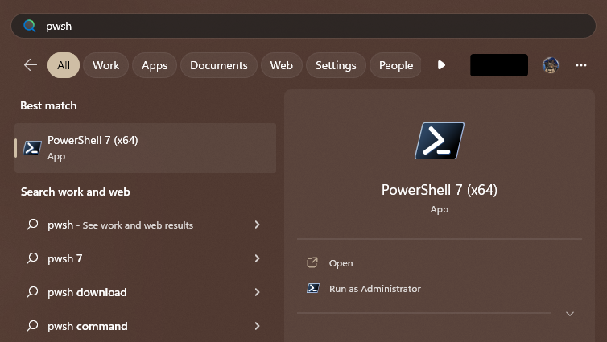
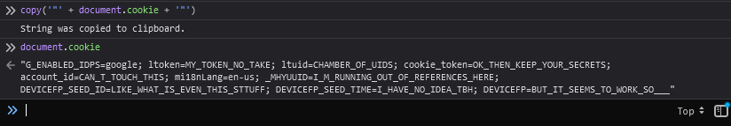
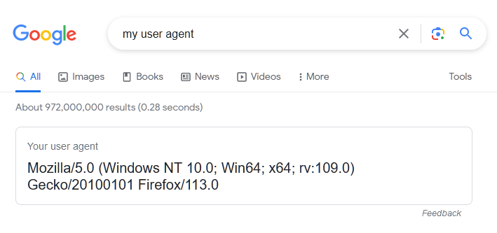

<!-- omit in toc -->
# Star Rail Daily Login Claimer

*Claim your daily login rewards for [Star Rail](https://hsr.hoyoverse.com/en/) from [Hoyolab](https://hoyolab.com) via PowerShell!*

<!-- omit in toc -->
## Table of Contents

- [About](#about)
- [Getting Started](#getting-started)
  - [Prerequisites (Install)](#prerequisites-install)
  - [Prerequisites (Configure)](#prerequisites-configure)
- [Usage](#usage)
- [A Warning To Those Who Use This](#a-warning-to-those-who-use-this)

## About

Tired of having to open the browser, navigate to Hoyolab and click the claim
button every day? This PowerShell module will save you literally seconds of your
life!

## Getting Started

Nothing's free in life, and this script is no exception. To get started you'll
need to follow some instructions. Afterwards you'll have to use the spooky
hacker command line interface. Don't worry, it's not that scary.

### Prerequisites (Install)

You'll need to install PowerShell Core and a module from PSGallery. Don't worry,
I'll walk you through it step by step.

1. Install PowerShell Core. Microsoft have pretty decent instructions
   [here](https://learn.microsoft.com/en-us/powershell/scripting/install/installing-powershell-on-windows?view=powershell-7.3)
2. Open PowerShell Core. You can find this in the start menu by searching for
   `pwsh`. It should look like this:  



1. Install this script by typing:

```powershell
Install-Module -Name InstallModuleFromGitHub
Install-ModuleFromGitHub -GitHubRepo qqii/GetStarRailDaily -Scope CurrentUser
```

You'll need to press "Y" when it tells you to. There'll be some fancy text and
progress bars, but don't worry about that. It's just the script installing.

### Prerequisites (Configure)

Now that you've got the script installed, we'll need to give it something called
a cookie. This is a magical ingredient that allows the script to log in to your
account. Make sure to keep it secret and ABSOLUTELY do not share it with anyone!
I'm serious. Don't do it.

Before we get your cookie, we'll need to setup the script. I'll hold you hand
the whole way, but I'll spare you the technical details.  

1. Type `New-Item -Type File -Force $PROFILE && explorer.exe $PROFILE` into your
   PowerShell Core window and press enter. Magically Notepad will appear.
   _Spooky!_
2. In the document, copy and paste the following incantation:

```powershell
function daily {
    $_ = Get-StarRailDaily `
    -Cookie "<cookie>" `
    -UserAgent "<useragent>"

    return
}
```

It's not ready yet, so we'll need to get some ingredients.

3. Go to [HoYoLAB](http://hoyolab.com) and log in to your account.
4. Press `F12` to open Developer Tools. _Ooooh, spooky hacker stuff!_
5. Type `copy(document.cookie)` into the console and press enter.
   It should say "String was copied to clipboard.", but if it doesn't try typing
   `document.cookie` and copy everything between the quotation marks.



6. Replace the `<cookie>` part of the document we opened in Notepad. Leave the
   quotes.
7. [Google "my user agent" (or click me!)](https://www.google.com/search?q=my%20user%20agent)



8. Copy and paste the user agent into the document, replacing `<useragent>`.
   Once again, don't you date touch those quotes

Your notepad document should now look something like this:

```powershell
function daily {
    $_ = Get-StarRailDaily `
    -Cookie "G_ENABLED_IDPS=google; ltoken=MY_TOKEN_NO_TAKE; ltuid=CHAMBER_OF_UIDS; cookie_token=OK_THEN_KEEP_YOUR_SECRETS; account_id=CAN_T_TOUCH_THIS; mi18nLang=en-us; _MHYUUID=I_M_RUNNING_OUT_OF_REFERENCES_HERE; DEVICEFP_SEED_ID=LIKE_WHAT_IS_EVEN_THIS_STTUFF; DEVICEFP_SEED_TIME=I_HAVE_NO_IDEA_TBH; DEVICEFP=BUT_IT_SEEMS_TO_WORK_SO___" `
    -UserAgent "Mozilla/5.0 (Windows NT 10.0; Win64; x64; rv:109.0) Gecko/20100101 Firefox/113.0"

    return
}
```

9. Save and close the file. _If you're a 1337 hax0r like me you can press
   `Ctrl+S` and then `Alt+F4`._
10. Finally, close the PowerShell window so we finish clean, as good magicians
    do.

Well that was something. The runic incantations have been prepared and are
awaiting the magic incantation. Before that, let's take a break and admire our
work. Get a cup of coffee or something. You've earned it.

## Usage

Open PowerShell Core and type `daily`. Press enter. Give it a second. If you did
everything right, it should either say "Check in successful!" or "Already
checked in today.". 

If not then uh, try replacing the cookie with a fresh set after logging out and
back into Hoyolab. If that still doesn't work, create a github issue and I'll
try my best to help you out.

## A Warning To Those Who Use This

I take no responsibility of the security and safety of your account by using
this script. Definitely don't share your cookie with anyone, and do your due
diligence by reading [`GetStarRailDaily.ps1`](./GetStarRailDaily.ps1) to make
sure I'm not doing anything malicious. This script might also get your account
flagged or something. 

